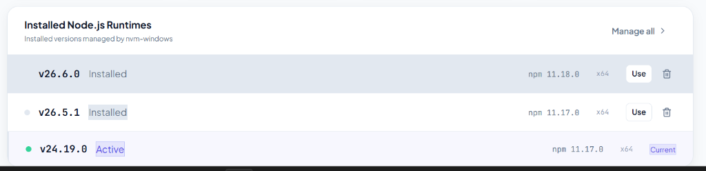

# NodePilot

A production-quality, modern desktop GUI client for managing Node.js versions, built with Tauri 2, React, TypeScript, and Rust. Inspired by NVM and nvm-windows.



## Features

- 🔍 **Detect** existing Node.js and NVM installations automatically
- 📋 **View** all installed Node.js versions with LTS, Active, and Current badges
- ⚡ **Switch** the active Node.js version (via `nvm use`)
- 📦 **Install** new Node.js versions from the official nodejs.org index
- 🗑️ **Uninstall** versions with confirmation dialogs
- 📊 **Activity log** — full history of all operations with stdout/stderr
- 🖥️ **Terminal panel** — live output during operations
- ⚙️ **Settings** — configure NVM paths, themes, and behavior
- 🔒 **Secure** — no shell string interpolation; all commands use validated argument arrays

## Requirements

### Windows (Primary Platform)

- **Windows 10 / 11** (64-bit)
- **nvm-windows** 1.1.x or later — [Download here](https://github.com/coreybutler/nvm-windows/releases)
- **Microsoft Visual C++ Redistributable** — usually already installed
- **Administrator privileges** — required for `nvm use` (symlink creation on Windows)

### Development Requirements

- **Node.js** 20+ (for building the frontend — install via nvm!)
- **npm** 10+
- **Rust** 1.77+ with MSVC toolchain
  ```
  rustup toolchain install stable-x86_64-pc-windows-msvc
  ```
- **Tauri CLI** (installed via npm as devDependency)
- **Microsoft Build Tools** — from Visual Studio Installer with "Desktop Development with C++" workload

## Development Setup

```bash
# 1. Clone and enter directory
git clone <repo>
cd nvmgui

# 2. Install frontend dependencies
npm install

# 3. Run in development mode (hot reloading)
npm run tauri dev

# 4. Run frontend tests
npm run test

# 5. Run Rust unit tests
cd src-tauri
cargo test
```

## Production Build

```bash
# Builds the NSIS/MSI installer into src-tauri/target/release/bundle/
npm run tauri build
```

The generated installer will be at:
```
src-tauri/target/release/bundle/nsis/NodePilot_1.0.0_x64-setup.exe
```

## Architecture

```
nvmgui/
├── src/                          # React frontend (TypeScript)
│   ├── components/
│   │   ├── layout/               # Sidebar, Header, Layout
│   │   ├── ui/                   # Badge, Modal, Toast
│   │   └── terminal/             # Terminal output panel
│   ├── pages/                    # Dashboard, Versions, Install, Activity, Settings
│   ├── hooks/                    # useNvm, useInstall (business logic)
│   ├── stores/                   # Zustand state stores
│   ├── services/                 # Tauri IPC wrappers
│   ├── types/                    # TypeScript interfaces
│   └── utils/                    # version parsing/sorting/filtering
│
└── src-tauri/                    # Rust backend
    └── src/
        ├── commands/             # Tauri #[tauri::command] handlers (IPC)
        ├── services/             # NodeVersionManager trait
        ├── platform/
        │   ├── windows/          # NvmWindowsService + NvmDetector
        │   ├── macos/            # Stub (future)
        │   └── linux/            # Stub (future)
        ├── models/               # Rust structs with Serde
        └── utils/
            ├── version_validator # Injection-safe validation
            └── process_runner    # Safe process execution (no shell strings)
```

## How NVM is Detected

NodePilot uses a multi-strategy detection cascade on Windows:

1. **Process environment** — checks `NVM_HOME` and `NVM_SYMLINK` env vars inherited by the process
2. **Windows Registry** — reads from `HKCU\Environment` and `HKLM\SYSTEM\...\Environment` directly
3. **Common paths** — scans known installation paths (`%LOCALAPPDATA%\nvm`, `C:\Program Files\nvm`, etc.)
4. **PATH search** — searches PATH entries for `nvm.exe`
5. **settings.txt fallback** — reads the nvm-windows configuration file

The symlink path is resolved from `NVM_SYMLINK` registry value, or from `settings.txt` (`path: ...` line).

## Security

NodePilot follows secure desktop application practices:

| Concern | Mitigation |
|---|---|
| **Command injection** | `version_validator.rs` rejects any string not matching `^\d+\.\d+\.\d+$` before use |
| **Shell execution** | `process_runner.rs` uses `Command::new("nvm.exe").args(["install", version])` — never `cmd /c "..."` |
| **Frontend access** | Tauri ACL: only specifically declared commands are exposed via IPC |
| **Path validation** | Settings paths are validated for shell metacharacters before use |
| **No secret storage** | No credentials, tokens, or secrets are stored by the app |
| **No auto-install** | NVM installer is only run after explicit user confirmation |

## NVM Switching and Admin Rights

On Windows, `nvm use` creates a symbolic link which requires **Administrator privileges**. If you run NodePilot as a normal user and try to switch versions, you will see:

> "Administrator permissions are required to switch Node.js versions. Please restart NodePilot as Administrator."

**Solution**: Right-click NodePilot → "Run as administrator".

## License

MIT
